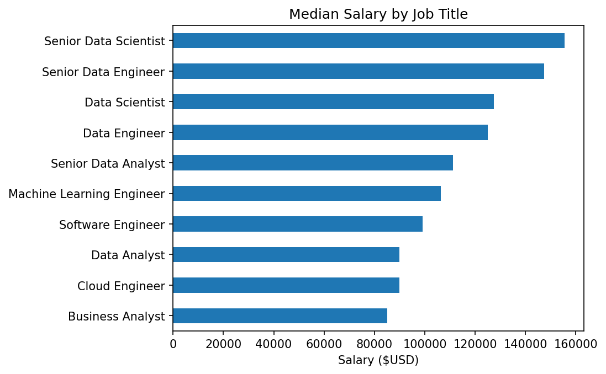
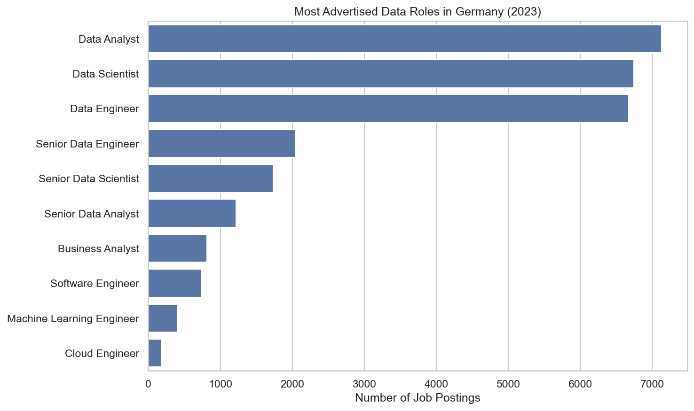
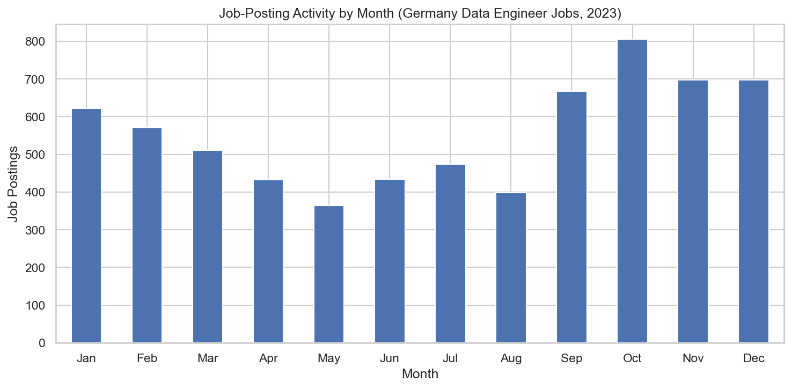
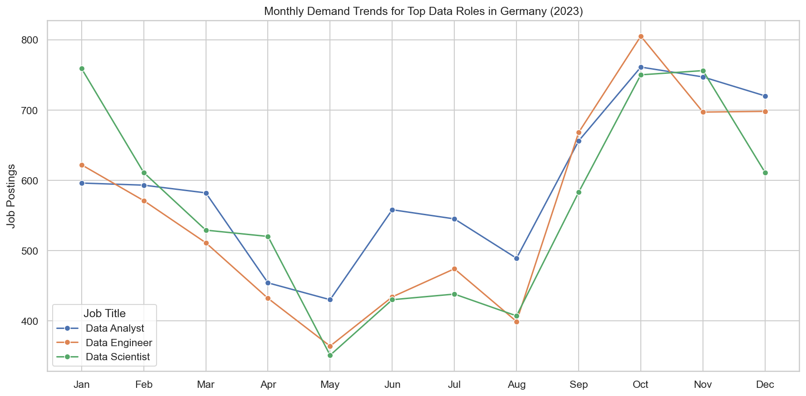
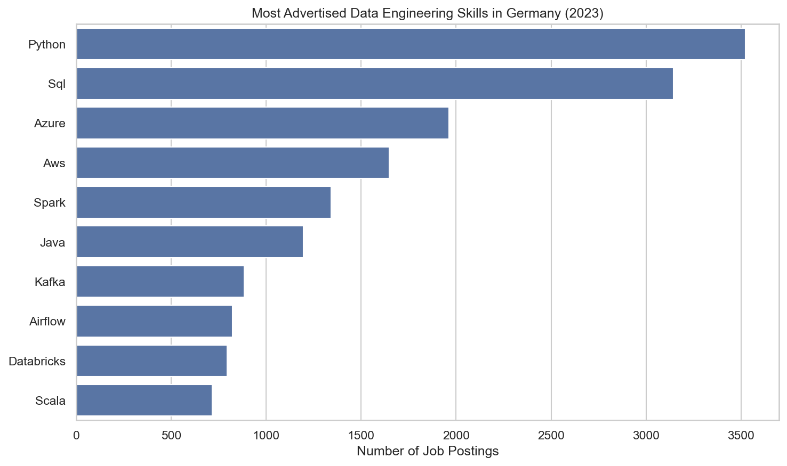
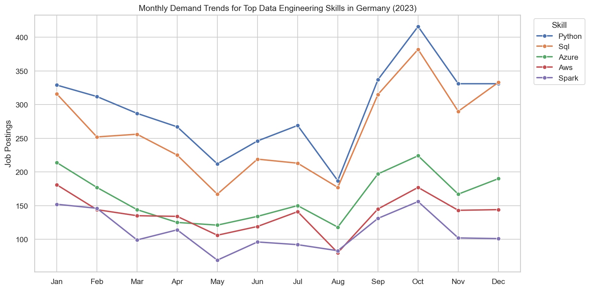
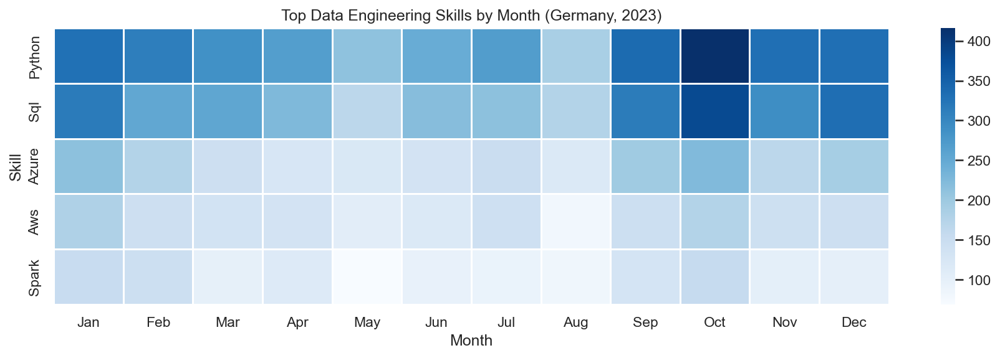
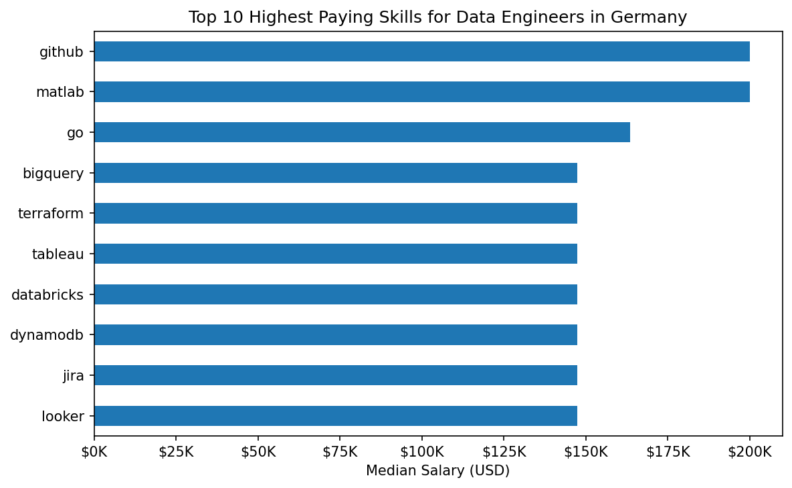
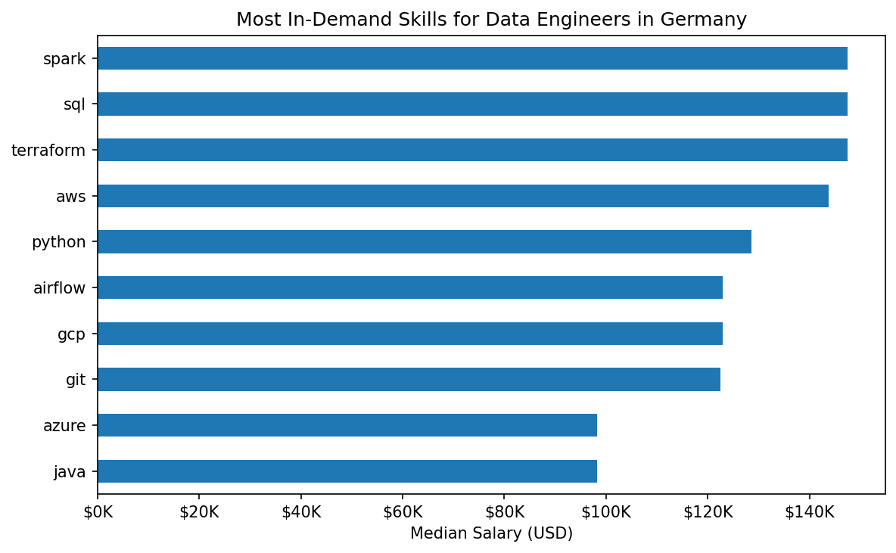
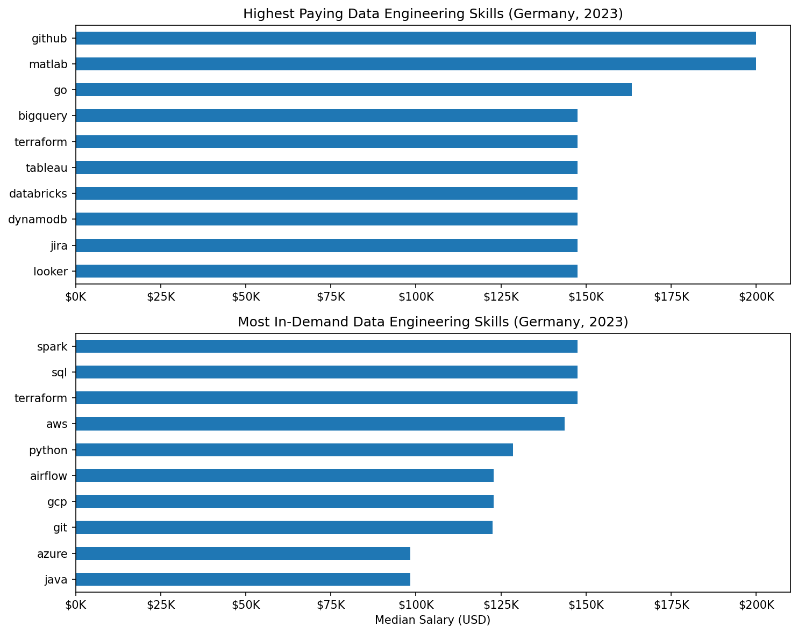

# data-jobs-analysis

> Applied data analytics using 2023 data-job postings, with Germany as the main working market.

Exercises build the data-oriented Python patterns needed before touching a DataFrame. Notebooks apply those skills progressively — from library fundamentals through demand analysis, trend tracking, and compensation investigation. The project applies the same methodology in a structured five-notebook study of the Indian market.

---

## Contents

| Path | Description |
| --- | --- |
| `exercises/` | 2 exercises covering data-oriented Python patterns |
| `notebooks/` | 5 analysis notebooks with figures |
| `project/job-market-analysis/` | Structured analysis of India's data-job market |

---

## Exercises

| # | File | Concepts |
| --- | --- | --- |
| 01 | `01_job_role_matcher.py` | Lists · dicts · for loops · `all()` · membership testing · `str.join()` |
| 02 | `02_job_data_cleanup.py` | `datetime` parsing · `ast.literal_eval()` · dicts · in-place mutation |

**01 — Job Role Matcher.** Matches a current skill set against predefined role requirements. Each role specifies required skills as a list; the script uses `all()` with a generator to test subset membership in a single readable expression — the same pattern used in every filtering step downstream.

**02 — Job Data Cleanup.** Converts string-encoded job records into typed Python objects. Skill strings are parsed with `ast.literal_eval()` and date strings are converted with `datetime.strptime()`. This is exactly the parsing logic that appears at the top of every subsequent notebook.

---

## Notebooks

All notebooks use the [Luke Barousse Data Jobs dataset](https://huggingface.co/datasets/lukebarousse/data_jobs) and are scoped to Germany unless stated otherwise.

| # | Notebook | Focus |
| --- | --- | --- |
| 01 | `01_pandas_basics.ipynb` | DataFrame operations · filtering · `groupby` · salary statistics |
| 02 | `02_matplotlib_basics.ipynb` | First chart: median salary horizontal bar |
| 03 | `03_job_demand_analysis.ipynb` | Role demand · posting seasonality · monthly trend lines |
| 04 | `04_trending_skills_analysis.ipynb` | Skill frequency · monthly skill trends · heatmap |
| 05 | `05_skill_pay_analysis.ipynb` | Highest paying skills · in-demand skills · reach vs pay |

---

### 01 — Pandas Basics

Introduces the data loading, cleanup, and aggregation workflow used throughout the module. Covers datetime conversion, country-based filtering, and `groupby` salary statistics by job title. No chart is produced; the focus is understanding the dataset before visualising it.

---

### 02 — Matplotlib Basics

Produces the first visualisation from the dataset: a horizontal bar chart of median salary by job title across all global postings.



---

### 03 — Job Demand Analysis

Identifies the most advertised data roles in Germany and maps how job-posting volume changes across the calendar year.

**Key findings:**
- Data Analyst was the most frequently advertised role, with more than 7,000 postings
- Data Scientist and Data Engineer followed closely, confirming broad demand across all three core functions
- Job-posting volume declined mid-year and reached its lowest point in May
- October recorded the highest job-posting activity of the year







---

### 04 — Trending Skills Analysis

Counts skill mentions across Data Engineer postings, tracks monthly demand for each skill, and renders a heatmap for the five most frequently requested skills.

**Key findings:**
- Python appeared in 3,524 postings — the most of any single skill
- SQL matched Python's demand throughout the year, confirming its foundational role
- Cloud platforms (Azure, AWS) were consistently requested across all twelve months







---

### 05 — Skill Pay Analysis

Compares compensation evidence with demand evidence for Data Engineer skills in Germany. Salary data is sparse (39 records); all findings are treated as directional signals rather than market benchmarks.

**Key findings:**
- GitHub and MATLAB were associated with the highest disclosed median salaries (~$200K), but each appears in very few postings
- The highest-paying skills are not the most frequently requested, revealing a clear reach vs. pay trade-off
- Python, SQL, cloud platforms, and orchestration tools score well across both dimensions







---

## Project

### job-market-analysis

A structured multi-notebook study of India's data-job market using the same dataset. Covers market structure, skill architecture, skill evolution, salary analysis, and a Pareto frontier analysis of Data Analyst skill strategy.

See [`project/job-market-analysis/README.md`](project/job-market-analysis/README.md) for full documentation.

---

## Structure

```text
data-jobs-analysis/
├── exercises/
│   ├── 01_job_role_matcher.py
│   └── 02_job_data_cleanup.py
├── notebooks/
│   ├── figures/
│   │   ├── highest_paying_vs_most_in_demand_data_engineering_skills_germany_2023.png
│   │   ├── job_postings_by_data_engineering_skill_germany_2023.png
│   │   ├── job_postings_by_data_role_germany_2023.png
│   │   ├── job_postings_by_month_data_engineer_germany_2023.png
│   │   ├── job_postings_by_month_top_data_engineering_skills_germany_2023.png
│   │   ├── job_postings_by_month_top_data_roles_germany_2023.png
│   │   ├── job_postings_heatmap_top_data_engineering_skills_germany_2023.png
│   │   ├── median_salary_by_data_engineering_skill_germany_top_10.png
│   │   ├── median_salary_by_job_title.png
│   │   └── median_salary_by_top_data_engineering_skills_germany.png
│   ├── 01_pandas_basics.ipynb
│   ├── 02_matplotlib_basics.ipynb
│   ├── 03_job_demand_analysis.ipynb
│   ├── 04_trending_skills_analysis.ipynb
│   └── 05_skill_pay_analysis.ipynb
└── project/
    └── job-market-analysis/
        ├── figures/
        ├── 01_market_overview.ipynb
        ├── 02_skill_demand.ipynb
        ├── 03_skill_evolution.ipynb
        ├── 04_salary_analysis.ipynb
        ├── 05_market_insights.ipynb
        └── README.md
```

---

## Data Source

[Luke Barousse Data Jobs dataset](https://huggingface.co/datasets/lukebarousse/data_jobs) — job postings from calendar year 2023.

- Upstream license: Apache-2.0
- Dataset revision: `1d815e9ce232eb27db11939c44eb048fe6d2e9ab`
- `data_jobs.csv` SHA-256: `635241ed09ccee18bdae1f83b45f26d6759e0aa2513c529f6190e9054062436c`

The notebooks pin the Hugging Face dataset revision so the analytical input does not silently change when upstream `main` changes. The dataset itself is not redistributed in this repository.

---

## Requirements

```bash
pip install -r requirements.txt
```

Dependencies: `datasets` · `pandas` · `matplotlib` · `numpy` · `seaborn`
