# India Data Jobs Market Analysis

## Executive Summary

This project investigates the structure of India's data-jobs market using 51,088 job
postings from the 2023 Data Jobs dataset. The analysis addresses five connected
questions — market structure, skill demand, skill evolution, compensation evidence,
and Data Analyst skill strategy — across five reproducible notebooks.

---

### Market Structure

India contributes 6.5% of global postings. Data Engineer, Data Scientist, and Data
Analyst roles account for **75.3%** of India postings.

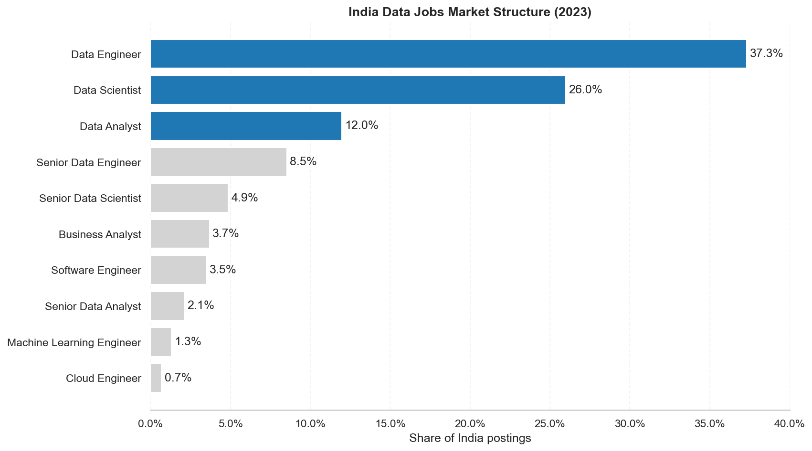

Bengaluru is the largest named hiring hub, accounting for the majority of city-specific
postings. However, generic `India` and `Anywhere` labels cover a substantial share of
demand, making location precision imperfect.

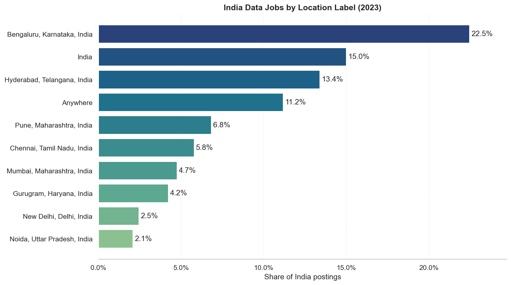

The ten most active employers contribute only **5.8%** of postings (Employer HHI ≈ 9),
confirming that demand is highly fragmented across the employer base. Candidates can
target geographic hubs but should not limit their employer strategy to a few visible
companies.

---

### Skill Architecture

SQL and Python form the shared technical foundation across the three largest role
families. Role-specific stacks diverge clearly beyond this core.

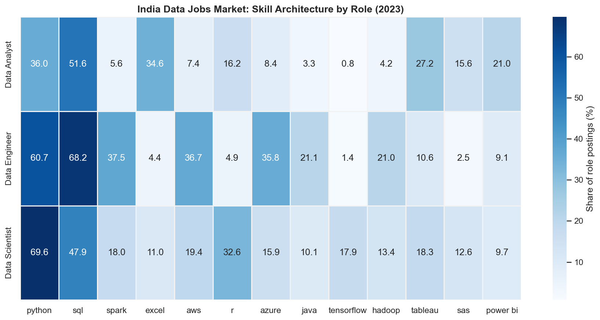

The skills with the largest prevalence spread across roles provide the clearest
signal of role specialisation.

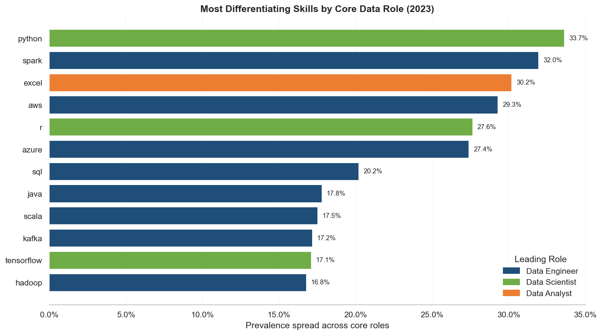

Employer demand is structured around skill bundles rather than isolated tools.
Python and SQL appear together in over **40%** of India data-job postings.

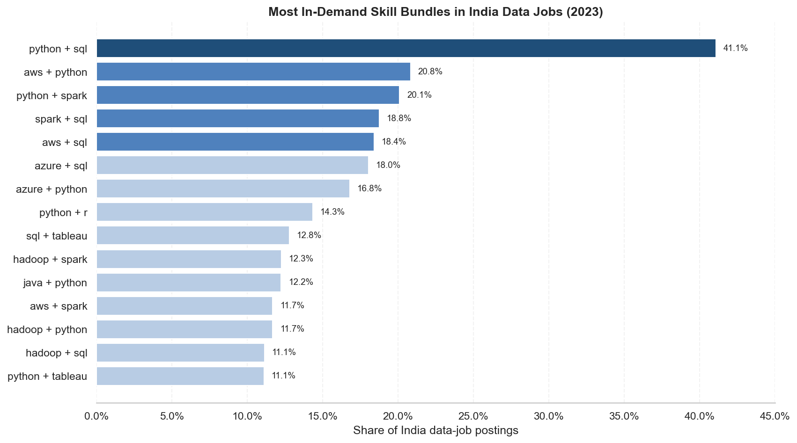

---

### Skill Evolution

The Data Analyst skill core remained broadly stable during 2023. Power BI recorded
the largest positive half-year movement among established skills at **+4.4 percentage
points**. Spark experienced the largest decline.

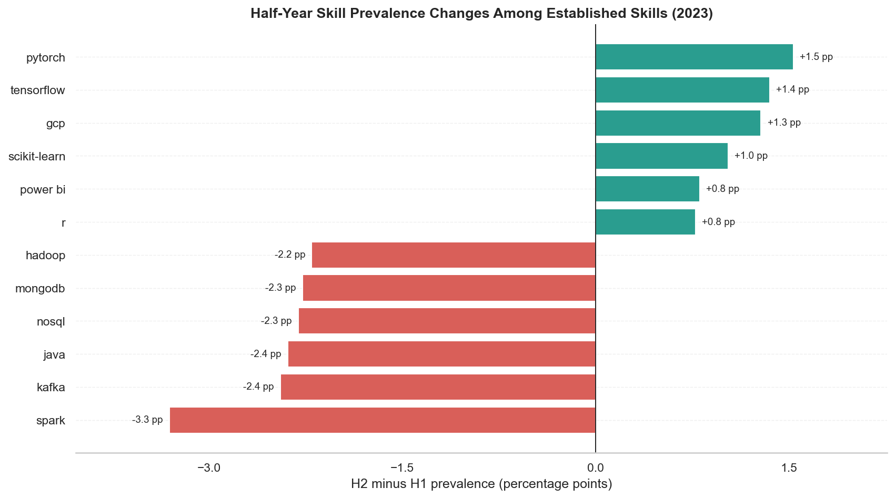

Month-to-month volatility was common but did not translate into a structural
reordering of the skill hierarchy. Core technologies maintained their relative
positions throughout the year.

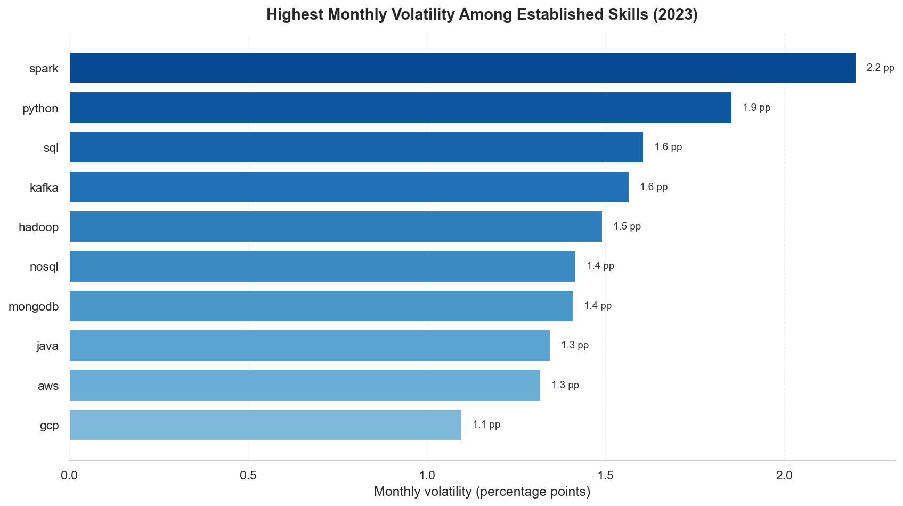

---

### Compensation Evidence

Only **582 India postings (1.1%)** disclose annual salary. No role has enough
coverage to support market-representative salary benchmarks.

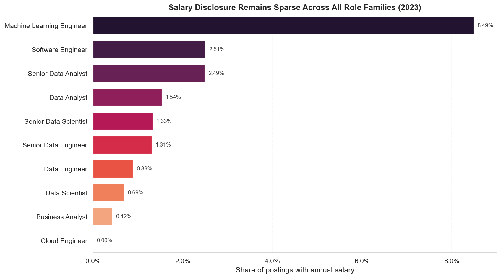

The disclosed subset overrepresents some role families and underrepresents others,
creating selection bias that limits cross-role comparisons.

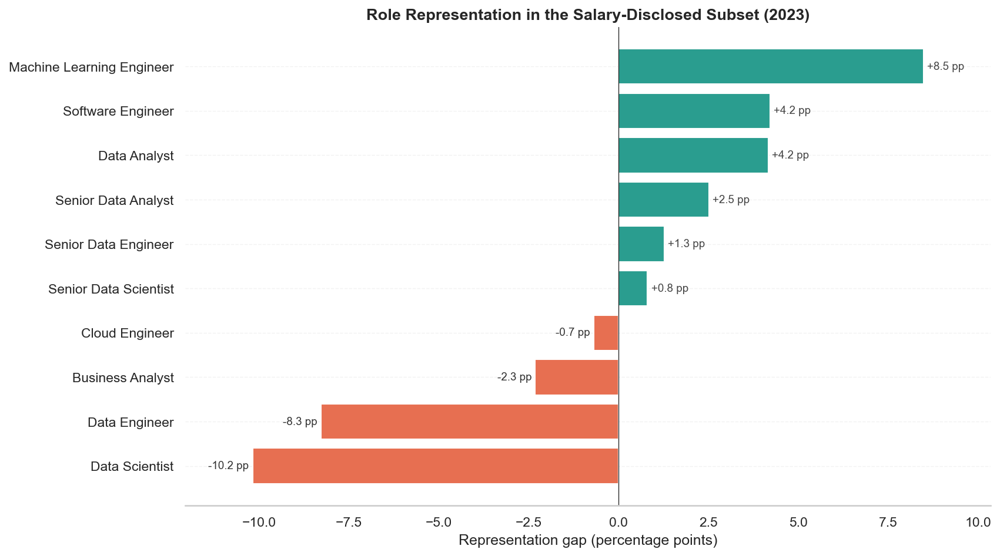

Within the disclosed subset, technical and senior roles lead on median salary.
All figures are presented with sample sizes and interquartile ranges.

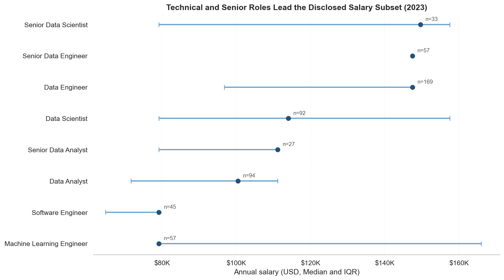

---

### Data Analyst Skill Strategy

For Data Analyst roles specifically, SQL offers the broadest market reach and the
strongest salary evidence base. Power BI and Tableau occupy higher pay-signal
positions on the Pareto frontier with meaningful but narrower reach.

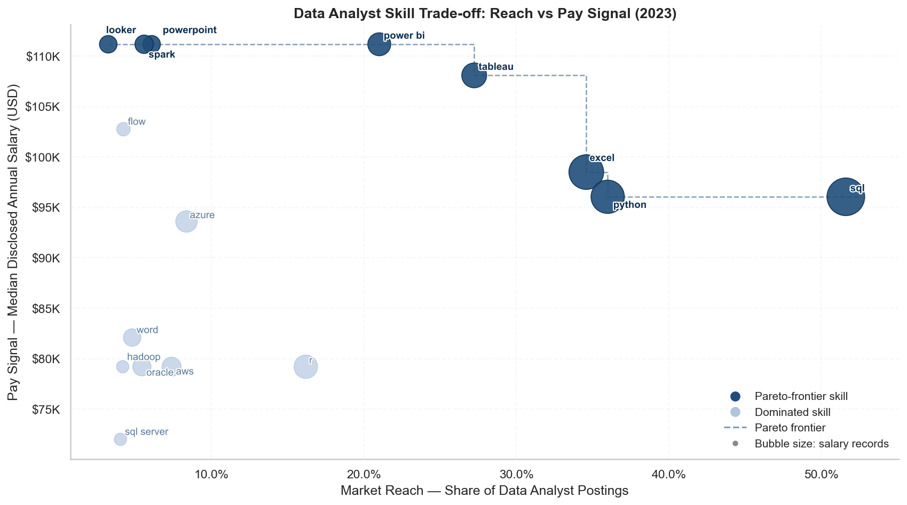

The reach ranking across all established analyst skills confirms SQL and Python as
the dominant access tools, followed by Excel and the BI platforms.

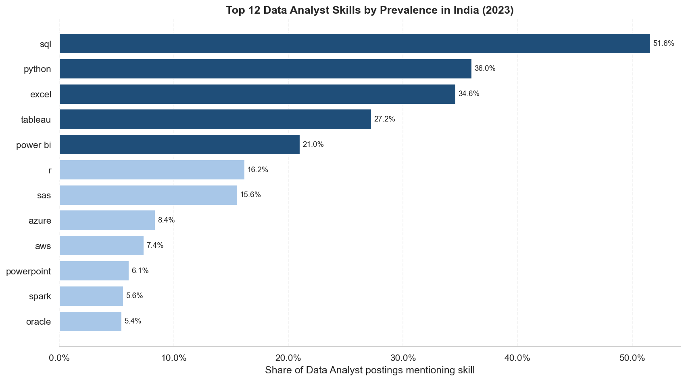

Evidence quality varies significantly across skills. Every salary comparison should
be read alongside the salary record count.

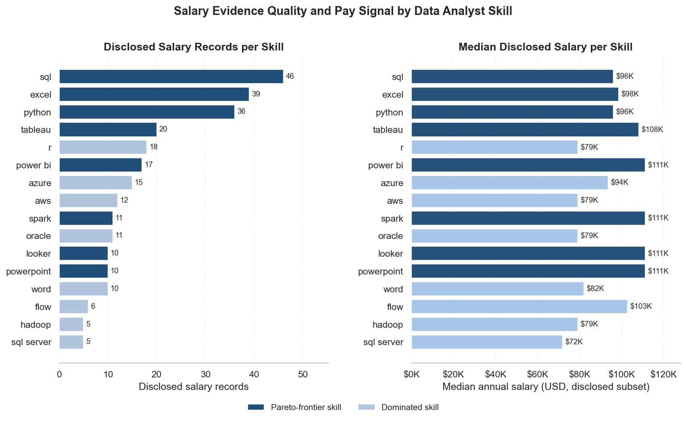

---

## Analytical Objective

The analysis answers five connected questions:

1. How is advertised data-job demand structured across roles, locations, and employers?
2. Which skills provide broad market access, and which distinguish specific role families?
3. Did Data Analyst skill demand materially change during 2023?
4. What compensation comparisons are defensible given the available salary evidence?
5. Which Data Analyst skills offer the strongest trade-offs between market reach,
   pay signal, and evidence quality?

The project treats a posting as a signal of advertised demand, not as a completed hire.
Metrics are designed around prevalence, concentration, change, coverage, and sample
strength rather than raw counts alone.

---

## Investigation

| Notebook | Analytical Purpose |
| --- | --- |
| [01 Market Overview](01_market_overview.ipynb) | Establish market structure, concentration, and evidence quality. |
| [02 Skill Demand](02_skill_demand.ipynb) | Separate shared foundations from role-defining skills and analyst skill bundles. |
| [03 Skill Evolution](03_skill_evolution.ipynb) | Distinguish sustained skill movement from monthly posting noise. |
| [04 Salary Analysis](04_salary_analysis.ipynb) | Assess salary missingness, selection bias, and defensible role comparisons. |
| [05 Market Insights](05_market_insights.ipynb) | Evaluate Data Analyst skill trade-offs using a Pareto frontier across reach, pay signal, and evidence quality. |

---

## Metric Design

| Metric | Definition |
| --- | --- |
| Role or location share | Segment postings ÷ all India postings |
| Skill prevalence | Postings mentioning a skill ÷ postings in the relevant role or period |
| Prevalence spread | Difference between a skill's highest and lowest prevalence across core roles |
| Half-year change | H2 prevalence − H1 prevalence, in percentage points |
| Salary coverage | Postings with annual salary ÷ all postings in a segment |
| Employer HHI | Sum of squared employer posting shares × 10,000 |
| Pareto frontier | Skills not dominated by another eligible skill on both prevalence and median disclosed salary |

---

## Data and Limitations

**Source:** [Luke Barousse Data Jobs dataset](https://huggingface.co/datasets/lukebarousse/data_jobs)

The dataset contains job postings from calendar year 2023. Important limitations:

- Posting volume is not equivalent to hires or unique vacancies.
- Duplicate or syndicated listings may inflate demand.
- Skill mentions do not measure proficiency requirements.
- Employer and location labels are not fully standardised.
- Salary is missing for **98.9%** of India postings and may be missing systematically.
- Salary values are standardised annual USD figures and may not reflect local
  compensation structures precisely.
- The analysis does not establish current market conditions or causal salary premiums.
